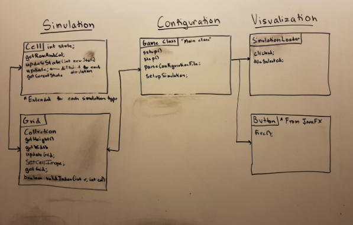
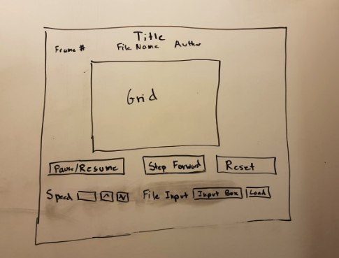

# Simulation Design Plan
### Team Number 10
### Names Michael Dodd (mmd61), Frank Tang (ft39), Amjad Syedibrahim (as878)

## Introduction

The problem we are trying to tackle is to build a general simulation tool for Cellular Automata simulations, which can then be extended to specific applications.

The primary design goals is to have functionality to add new simulations without much hassle. We also intend to have flexibility changing the basic visualization features of each simulation.

For the primary architecture of the design, we plan on making this program closed and open in the following ways:
* The way that the program updates cells be the same for all the specific simulation configurations. Namely, the primary architecture will have cells check all of its neighbors in one frame of time and then update all the cells in another frame of time. The way that the simulation program recognizes each state of cells will be closed, but the initial conditions and simulation rules will be open for new simulations to be added. 
* We would also like some portions of the visualization of our program to be open so the user can change the way they see the simulation. For example the color associated with each of the different state should be able to change.
* How the grid will be made will be closed, but the dimensions of the grid will be open to be flexible in how large we want the simulation to be.

## Overview

The program is divided up based on simulation, configuration, and visualization. There will be a Game class that handles the general operations of each simulation, and sets up each simulation based on its type. The Grid class will be the main structure for each simulation, holding all of the cells and updating them based on the specific rules of the simulation. Finally, there will be an abstract Cell class that has basic methods common to all types of cell. There will be a separate class for each type of simulation that will extend the cell class and implement any additional methods that are unique to the simulation type. We discussed two different implementation for the structure holding our grid of cells: a hashmap and a 2D array. We are currently leaning towards a 2D Array but decided to keep the variable of type Collection and designed our methods to work for any Collection. We also discussed implementing 5 different types of cells for each of the simulations instead of implementing a master class Cell and extending it for each of the simulations. We decided to create a master class and extend it but either way the rest of our methods still work. By writing our methods in a general format we were able to consider different implementations for many different parts of our program.

Simulation:
* Cell.java superclass, extended by simulation-specific Cell subclasses
    * int, int getRowAndCol()
    * getNeighbors()
    * void update()
    * int getCurrentState()
    * void setCellImage() 
* Grid.java
    * Collection
    * int getHeight()
    * int getWidth()
    * void updateGrid()
    * boolean validIndex(int row, int col);
Configuration:
* Main class
    * void start (Stage stage)
    * Void step(double elapsedTime)
    * Void parseConfigurationFile()
Visualization:
* SimulationLoader
    * void display()
    * void clicked()
    * Void fileSelected()

## User Interface
Appearance:

The grid with the cells will be the main focus of the program where the simulation will be displayed. There will be many additional buttons down below the simulation to alter various settings. A pause/play button will allow the user to stop and resume the simulation at will. The step forward function will allow the user to fast forward one frame while the program is paused. The reset button allows the user to restart the same simulation with the initial state being specified from the configuration file. There are also be functionality to adjust the speed of the simulation, to make it both faster or slower. Finally, the user can select from different simulation types and load in different configuration files. Near the top left of the screen, a number will be displayed representing the current frame that the program is on.

How the user will interact:
* Pause/Resume - This button will pause/resume the current simulation
* Step Forward - Moves the simulation one frame forward
* Reset - Resets the current simulation to the beginning
* Speed(Up and Down Arrow Buttons) - Speeds up/slow down the speed that the simulation is running at
* Input Box/Load - User will select new Simulation and then Load the new simulation into the program

Possible Errors:
* Trying to fast forward after the simulation is done.
* Incorrect file path for the config file
* Trying to fast forward while the simulation is running

## Design Details
##### Simulation:
* Cell.java superclass, extended by simulation-specific Cell subclasses
    * This superclass is created with the intention of using inheritance with Cell subclasses that represent a specific simulation. For example, the Spreading of Fire simulation would have a subclass with a same like “FireCell.java” that would hold the simulation’s specific properties like probability and updating a cell. 
    * We wanted to use this inheritance structure because the cells in a simulation are primarily what define a simulation; things like the grid structure (while changing in size) will still only act as the holder of these cells, and the visualization will be constant regardless of the simulation.

As for this superclass’s abstract methods, we chose them for the following purposes and reasons:
* int, int getRowAndCol()
    * The purpose of this method is to return the location of the row and column of a cell in the grid. This gives us the (x,y) coordinates of the specified cell.
    * We need this method because we need the cell’s coordinates to be able to ping this cell’s neighboring cells for their states in order to determine how this cell’s update will go
* getNeighbors()
    * The purpose of this method is to return the states of the neighboring cells of the current queried cell
    * This method will ping the neighbors of this cell, using the later method of getCurrentState() to get the state of all the neighbors
    * We need this method in order to figure out the states of the neighboring cells, which will then determine how this cell will update
* void update() 
    * The purpose of this method is to update the state of this cell, deciding whether to change its state or keep it the same depending on its neighbors
    * We need this method because it is the crux of how this simulation will work; each of the simulation subclasses will have different update methods for their cells that will hold the particular rules of the simulation. For example, this update method could be changing the state of this cell depending on whether or not a certain amount of neighbors are alive, or if the cell begins to burn based on a set probability
* int getCurrentState()
    * The purpose of this method is to return the state of the cell
    * We need this method because we will be calling it to get the states of the neighboring cells. This returned state of the neighboring cells will ultimately be used in the update method.
* void setCellImage() 
    * The purpose of this method is to change the image of the current cell
    * This method is needed for the graphical representation of the simulation and will allow us to change how each cell looks like as we change its state.

Grid.java
* This class is intended to be used as the structure that holds the Cell objects. This class does not need to be a superclass like the Cell class because the Grid does not to be specific to each simulation.
This Grid class will hold cells, but will be passed the size that it needs to be so that it can scale the size of the cells graphically for the visualization.
We intend to use two Grid objects, one for displaying in the visualization graphically, and the second grid for determining the next frame for the simulation. This is because we need to update the cell’s via a current snapshot of the simulation as a whole, meaning that we cannot just update one Grid object in real-time because it will affect the update of the next cells in that Grid. So, we plan on having a Grid that is displayed in the visualization, and one Grid for making the next frame, which will then be used to update the first Grid for visualization.
	
As for this class’s methods and variables, we chose them for the following purposes and reasons:
* private Collection Grid
    * This private Collection variable is to act as the object that holds all the Cells. We have our Grid as a Collections structure to be able to encompass a change in structure as necessary, such as making this Grid variable a 2D Array or a HashMap. However, we are currently leaning towards using a 2D Array for holding the cells, but will consider other structures if the use of memory is an issue.
* int getHeight()
    * The purpose of this method is to get the amount of rows that this grid has.
    * We need this method in order to determine how large this grid is in order to set boundaries for the visualization and simulation.
* int getWidth()
    * The purpose of this method is to get the amount of columns that this grid has.
    * We need this method in order to determine how large this grid is in order to set boundaries for the visualization and simulation.
* void updateGrid()
    * The purpose of this method is to update the Grid object with the correct cells in it.
    * We need this method in order to properly run the simulation.
    * It will most likely consist of a double for loop structure that will replace the cell at a specific index with the updated cell. After running this method, the Grid object will be updated to the next frame of the simulation.
* boolean validIndex(int row, int col)
    * The purpose of this method is to check if the index that we are checking for the cell is a valid index of the Grid
    * We need this method in order to make sure that we aren’t checking a cell that does not exist. So, it prevents us from receiving a null pointer exception when checking cells on the edge.
    
##### Configuration:
* Main class
    * This class is intended to be the class that runs the simulation indefinitely.
    * Our idea behind this class is that we are going to call this Main class from the visualization portion of this project. This will allow us to be able to switch simulations, even when we are in the middle of a simulation because we can just clear the current simulation and call main with the new simulation data. 

As for this class’s methods and variables, we chose them for the following purposes and reasons:
* void start (Stage stage)
    * The purpose of this method is to set up the Grid and initial objects of the simulation. 
* Void step(int frameNumber)
    * The purpose of this method is to be the method that updates the simulation frame by frame.
    * This method is needed in order to update the simulation as time goes on.
    * In this method, we plan on using a method like .sleep() in order to delay the simulation from updating very quickly. The parameter of time that is passed into .sleep() will be used to speed up/slow down the simulation speed through the visualization portion of the project.
* Void parseConfigurationFile()
    * The purpose of this method is to read through a configuration file to get the correct information
    * We need this method in order to read through a configuration file in order to use the correct simulation cell subclass. 
#####Visualization:
* SimulationLoader
    * This class is for the part of the project that visualizes the simulation program.
    * This class is to be used as a way to launch the main class with the specific simulation that we want to run.
    * We plan on using this class to set up the appearance of the program with the specified graphical interface that includes the simulation title, the simulation speed toggles, loading simulation button, reset button, step forward button, frame number, and the visual of the grid simulation.

As for this class’s methods and variables, we chose them for the following purposes and reasons:
* void display()
    * This method displays the appearance of the simulation program
* void clicked()
    * This method is used to track mouse click inputs for the various outputs that we are using, such as the reset button, step forward button, speed up/slow down, etc.
* Void fileSelected()
    * This method is used to determine the simulation configuration file that is to be used in the simulation program.
    * This method will be used to set up the first simulation and when we want to load up a new simulation.

## Design Considerations
One issue we considered while creating our design plan was how we would refresh the simulation from frame to frame without letting the update of one cell affect the update of another cell. We came up with two options initially: have two grids that switch back and forth or create a new grid for each new case. The first option is good because it takes less memory but it may get confusing which grid should be displayed. The second option uses a huge amount of memory but it is algorithmically simple. After considering the pros and cons we decided we would have two arrays with one being the new grid and one being the grid that is currently being displayed. This way we could update the temporary grid based on the old grid that is being shown and then set the grid being shown equal to the temporary grid.
We also spent a decent amount of time debating which of our classes should change based on the simulation it is running. The main possibilities were: a separate simulation class or the cell class. We decided to pursue the option of the cell class because this was the area in our code we were planning on updating our cells from. Since the main difference between the simulations is the rules to change the state, it made more sense to include it with the cell class.

## Use Cases

Apply the rules to a middle cell: set the next state of a cell to dead by counting its number of neighbors using the Game of Life rules for a cell in the middle (i.e., with all its neighbors)
* Call grid[r][c].update(), which will check the state of the neighbors grid[r±1][c±1] and based on what percentage meets the dead condition, we will change the state of the cell or not using grid[r][c].updateState(*Fill in state*)

Apply the rules to an edge cell: set the next state of a cell to live by counting its number of neighbors using the Game of Life rules for a cell on the edge (i.e., with some of its neighbors missing)
* Call grid[r][c].update(), which will check the state of the neighbors grid[r±1][c±1] using validIndex(r, c) and based on what percentage meets the live condition, we will change the state of the cell or not using grid[r][c].updateState(*Fill in state*)

Move to the next generation: update all cells in a simulation from their current state to their next state and display the results graphically
* We will have 2 grids: grid1 and grid2. Grid1 will hold the current state of the grid and grid2 will be used to update. We will call grid2.update(grid1) which will iterate through each of the cells of grid2 and call update() on each of the cells. The update() method will use the states of grid1 to find its new state. Once grid2 is updated, grid1 will be set equal to grid2 so that the updated status is displayed.

Set a simulation parameter: set the value of a global configuration parameter, probCatch, for a simulation, Fire, based on the value given in an XML fire
* probCatch will be variable in the Game class. The Game class will have a method that parses the configuration file, which will update the probCatch variable accordingly with the right value.

Switch simulations: load a new simulation from an XML file, stopping the current running simulation, Segregation, and starting the newly loaded simulation, Wator
* Call the parseConfig method to get the new simulation, which will automatically interrupt the current ongoing simulation. After that, the program will need to be launched as usual to run the new simulation.

## Team Responsibilities

* Team Member #1 - Michael Dodd
Cell class and Game Class and Cell update method for specific simulations

* Team Member #2 - Amjad Syedibrahim
Grid class and Game Class and Cell update method

* Team Member #3 - Frank Tang
SimulationLoader class and Button/other JavaFX classes and Cell class update method for specific simulations.

Overall, our team plans on having multiple meetings throughout this project, ideally every other day, as check-up meetings to ensure that our project is completed. These meetings will allow us to make sure that the team is always on the same page and that the project is being completed in a mutually agreed upon direction. Outside of these meetings, we plan on having each member code their specified part of the project, pushing to GIT as necessary. 

