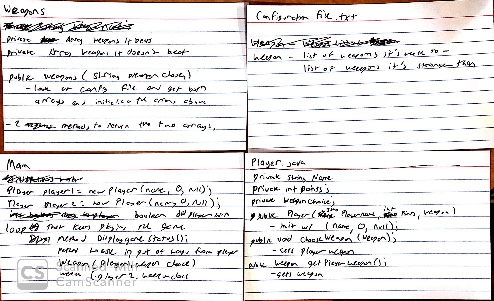

Names: Michael Dodd, Frank Tang

NetIDs: mmd61, ft39

# RPS_DESIGN.md

One design that we discussed with making the Rock, Paper, Scissor game would be the following:
* a Main.java class that acts as the main class that simulates the game of RPS.
	* Has a loop that acts as the game simulation of RPS
	* Has a method that takes the two weapons of the players and compares to see which wins, using the stored weapon interactions inside the specific weapon subclasses
	* gives a point to the player that wins that specific interaction
* a Player.java class that holds the information associated with a instance of a player and has methods to choose a weapon for a match. This class would also keep track of the player score.
	* has a method that either randomizes the weapon that the player has or has the player input the weapon of their choice
* an abstract Weapon.java superclass that contains:
	* an abstract method that holds the weapons that are stronger than the specific weapon
	* an abstract method that holds the weapons that are weaker than the specific weapon 
* Specific weapon subclasses (e.g. Rock.java) that extend the Weapon.java class to hold the specific weapons that it can and cannot beat

An alternative design would be the following:
* a Weapons.java class that has the parameters of what the two weapons the players chose
	*  These two weapons would then be checked against a configuration file to determine which weapon wins and passes a value to the Main.java class to determine which weapon won.

In these two designs, we can configuration file.
	add new weapons to the game, so long as we make subclasses that extend the Weapons super class in the first design, or we modify the configuration file to add the new weapon in the second design. 

Below are our CRC cards:

Some examples of Java calls:
* To create a new player: player1 =  new Player(name)
	* myName = name
	* myPoints = 0
	* myWeapon = Null
* To create a new weapon: weapon1 = new Weapon( weaponName)
	* This would scan a configuration file to find the list of weapons this weapon beats based on its name
* player1.chooseWeapon() 
	* This would randomly choose a weapon from the list of possible weapons and set myWeapon = the new weapon
	* 

> Written with [StackEdit](https://stackedit.io/).